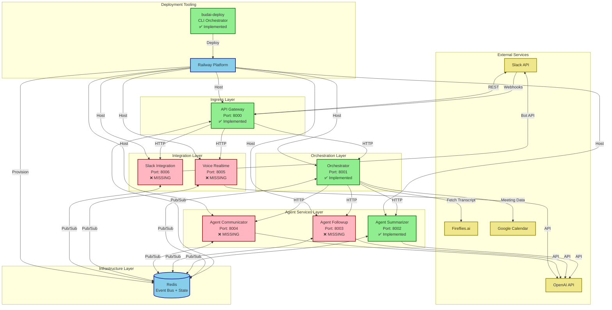
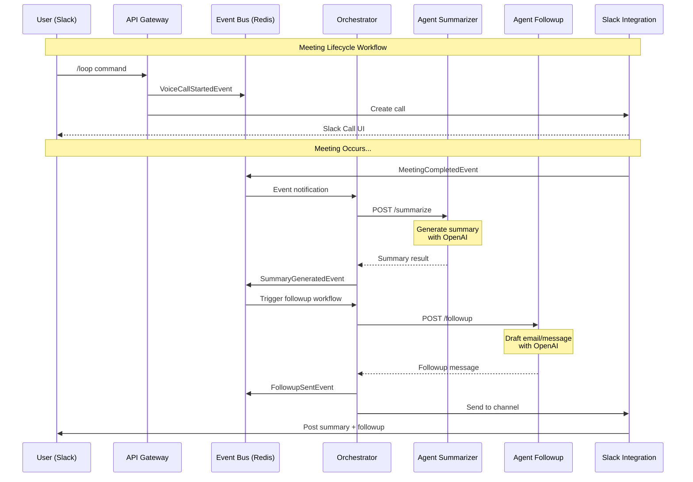
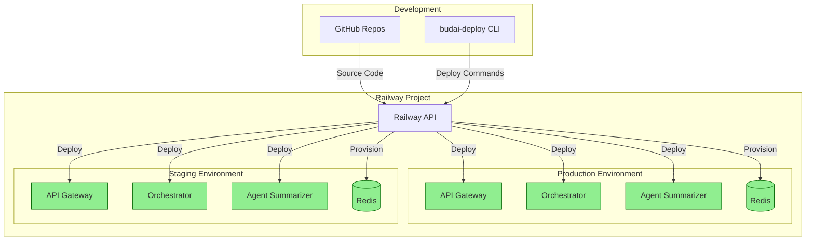

# BudAI System Architecture

## Overview

BudAI is a microservices-based AI meeting assistant platform that automates meeting preparation, summarization, and follow-up workflows. The system uses event-driven architecture with Redis Streams for inter-service communication.

## Architecture Diagram



## Event Flow Diagram



## Component Details

### ✅ Implemented Services

#### 1. **budai-deploy** (Deployment Orchestrator)
- **Purpose**: Multi-repository deployment orchestration
- **Technology**: Python CLI
- **Key Features**:
  - Clones service repos from GitHub at runtime
  - Manages deployment order based on dependencies
  - Provisions shared infrastructure (Redis)
  - Configures Railway services with environment variables
  - Supports assisted and zero-touch deployment modes
- **Location**: `C:\Users\jer\Documents\GitHub\budai-deploy\`

#### 2. **API Gateway** (Port 8000)
- **Purpose**: HTTP ingress and request routing
- **Technology**: FastAPI
- **Key Features**:
  - Slack webhook validation (HMAC signatures)
  - `/slack/commands/loop` - Handle Loop slash commands
  - `/slack/events` - Event subscriptions
  - `/api/realtime/session-token` - OpenAI session tokens
  - Routes requests to downstream services
  - Publishes events to Redis
- **Location**: `C:\Users\jer\Documents\GitHub\budai-api-gateway\`
- **Dependencies**: Redis, Slack API, Orchestrator

#### 3. **Orchestrator** (Port 8001)
- **Purpose**: Event-driven workflow coordination engine
- **Technology**: FastAPI + asyncio
- **Key Features**:
  - Subscribes to Redis Streams for events
  - Manages workflow state machines in Redis
  - Orchestrates multi-agent workflows:
    - Meeting prep (15min before)
    - Meeting summarization (after completion)
    - Follow-up (15min after summary)
  - Invokes agents via HTTP
  - Handles retries and error recovery
  - Workflow timeout monitoring
- **Location**: `C:\Users\jer\Documents\GitHub\budai-orchestrator\`
- **Dependencies**: Redis, Agent services, Google Calendar (optional)

#### 4. **Agent Summarizer** (Port 8002)
- **Purpose**: Meeting transcript summarization with structured output
- **Technology**: FastAPI + OpenAI API
- **Key Features**:
  - Generates structured meeting summaries
  - Extracts action items with owners/deadlines
  - Identifies risks and blockers
  - Captures key decisions
  - Uses OpenAI with JSON mode for deterministic output
- **Location**: `C:\Users\jer\Documents\GitHub\budai-agent-summarizer\`
- **Dependencies**: OpenAI API, Redis (for events)

### ❌ Missing Services

#### 5. **Agent Followup** (Port 8003) - NOT IMPLEMENTED
- **Purpose**: Draft follow-up emails and messages
- **Expected Features**:
  - Generate follow-up email content
  - Create Slack message threads
  - Schedule reminders for action items
  - Gmail/email integration
  - Use OpenAI for natural language generation
- **Referenced in**: Orchestrator, production.yaml
- **Status**: ⚠️ **CRITICAL MISSING COMPONENT**

#### 6. **Agent Communicator** (Port 8004) - NOT IMPLEMENTED
- **Purpose**: Handle conversational AI interactions
- **Expected Features**:
  - Process direct messages to bot
  - Conversational context management
  - Natural language command interpretation
  - Query meeting history
  - Use OpenAI for dialogue
- **Referenced in**: API Gateway, production.yaml
- **Status**: ⚠️ **MISSING COMPONENT**

#### 7. **Voice Realtime** (Port 8005) - NOT IMPLEMENTED
- **Purpose**: Real-time voice call handling
- **Expected Features**:
  - OpenAI Realtime API integration
  - Voice-to-text streaming
  - Session token generation
  - WebSocket connections for bidirectional audio
  - Voice activity detection
- **Referenced in**: API Gateway, production.yaml
- **Status**: ⚠️ **CRITICAL MISSING COMPONENT** (needed for /loop command)

#### 8. **Slack Integration** (Port 8006) - NOT IMPLEMENTED
- **Purpose**: Slack-specific integration logic
- **Expected Features**:
  - Slack Call API integration
  - App Home management
  - Message formatting and Block Kit
  - Channel management
  - User lookup and permissions
- **Referenced in**: API Gateway, production.yaml
- **Status**: ⚠️ **CRITICAL MISSING COMPONENT** (needed for /loop command)

## Infrastructure Components

### Redis
- **Purpose**: Event bus (Redis Streams) + State storage (KV)
- **Streams**:
  - `budai:events` - Main event stream
  - Consumer group: `budai-services`
- **Key Patterns**:
  - `budai:workflow:{workflow_id}` - Workflow state (7 day TTL)
  - `budai:session:{session_id}` - Session data
- **Provisioned by**: budai-deploy (via Railway)

### OpenAI API
- **Models Used**:
  - `gpt-4` or `gpt-4o` - Meeting summarization
  - `gpt-4` - Follow-up generation
  - `realtime-*` - Voice conversations
- **Used By**: All agent services, Voice Realtime

### Railway Platform
- **Services Deployed**:
  - All 8 microservices
  - Redis instance
- **Configuration**: `railway.json` in each repo (config-as-code)
- **Deployment**: Automated via GitHub connection

## Data Flow Patterns

### 1. Meeting Workflow
```
User invokes /loop command
  → API Gateway validates signature
  → Gateway publishes VoiceCallStartedEvent
  → Slack Integration creates Slack Call
  → Voice Realtime handles audio/transcription
  → On call end: VoiceCallEndedEvent
  → Orchestrator receives MeetingCompletedEvent
  → Orchestrator invokes Agent Summarizer
  → Summary published as SummaryGeneratedEvent
  → Orchestrator waits 15min, invokes Agent Followup
  → Followup sent via Slack Integration
```

### 2. Event Bus Pattern
- **Publisher**: Any service can publish events
- **Consumer Groups**: Each service type has its own consumer
- **Acknowledgment**: XACK after successful processing
- **Retry**: Unacknowledged messages redelivered

### 3. Workflow State Management
- Orchestrator maintains workflow state in Redis
- Each workflow has:
  - Status (pending, running, waiting, completed, failed)
  - Current step tracker
  - Completed steps list
  - Retry counter
  - Error messages
- 7-day TTL on workflow state

## Missing Pieces Analysis

### Critical Missing Components

#### 1. **Voice/Call Handling Stack** 🚨 HIGH PRIORITY
- **Missing**: Voice Realtime service
- **Missing**: Slack Integration service
- **Impact**: Core feature `/loop` command completely non-functional
- **Dependencies**: 
  - OpenAI Realtime API integration
  - Slack Call API integration
  - WebSocket infrastructure
- **Effort**: ~2-3 weeks per service

#### 2. **Follow-up Automation** 🚨 HIGH PRIORITY
- **Missing**: Agent Followup service
- **Impact**: Meeting summaries generated but not automatically distributed
- **Dependencies**:
  - Email/Gmail API integration
  - Slack message composition
  - Template rendering
- **Effort**: ~1-2 weeks

#### 3. **Conversational Interface** ⚠️ MEDIUM PRIORITY
- **Missing**: Agent Communicator service
- **Impact**: No conversational AI, only slash commands work
- **Dependencies**:
  - Message routing from API Gateway
  - Context/session management
  - OpenAI conversation API
- **Effort**: ~2 weeks

### Missing Infrastructure

#### 4. **Observability Stack** ⚠️ MEDIUM PRIORITY
- **Missing**: Tracing backend (Jaeger/Tempo)
- **Missing**: Metrics aggregation (Prometheus)
- **Missing**: Centralized logging (Loki/ELK)
- **Impact**: Limited debugging and monitoring capabilities
- **Current State**: Code has tracing hooks but no backend
- **Effort**: ~1 week setup

#### 5. **Testing Infrastructure** ⚠️ MEDIUM PRIORITY
- **Missing**: Integration tests
- **Missing**: E2E test suite
- **Missing**: Load testing
- **Impact**: Deployments risky, no regression protection
- **Effort**: ~2-3 weeks

#### 6. **CI/CD Pipeline** ℹ️ LOW PRIORITY
- **Current**: Manual deployment via `python cli/deploy.py`
- **Missing**: Automated deployment on PR merge
- **Missing**: Automated testing in pipeline
- **Missing**: Staging environment deployments
- **Impact**: Manual deployment process, higher error risk
- **Effort**: ~1 week

### Missing External Integrations

#### 7. **Google Calendar Integration** ℹ️ LOW PRIORITY
- **Status**: Stub code exists in Orchestrator
- **Missing**: Full OAuth flow
- **Missing**: Calendar event webhooks
- **Impact**: Meeting prep workflow doesn't work
- **Effort**: ~3-4 days

#### 8. **Fireflies Integration** ℹ️ LOW PRIORITY
- **Status**: Placeholder code exists
- **Missing**: Fireflies API client
- **Missing**: Transcript fetching logic
- **Impact**: Falls back to inline transcripts
- **Effort**: ~2-3 days

#### 9. **Gmail/Email Integration** ℹ️ LOW PRIORITY
- **Missing**: Gmail API integration
- **Missing**: Email template rendering
- **Missing**: OAuth flow for Gmail
- **Impact**: Follow-ups can't be sent via email
- **Effort**: ~3-5 days

## Deployment Architecture



### Current Deployment Workflow

1. **Initialize**: `python cli/deploy.py explain --spec specs/production.yaml --creds creds.json`
2. **Validate**: `python cli/deploy.py validate --spec specs/production.yaml --creds creds.json`
3. **Deploy**: `python cli/deploy.py deploy --spec specs/production.yaml --creds creds.json --mode assisted`
4. **Verify**: `python cli/deploy.py verify --spec specs/production.yaml --creds creds.json`

### Deployment Order (Dependency-based)
1. Redis (infrastructure)
2. Orchestrator (core engine)
3. Agent Summarizer, Agent Followup, Agent Communicator
4. Voice Realtime, Slack Integration
5. API Gateway (ingress, depends on all)

## Security Considerations

### Implemented
- ✅ Slack webhook signature verification (HMAC-SHA256)
- ✅ Environment-based secrets management
- ✅ Railway secrets vault integration
- ✅ Redis password authentication

### Missing
- ❌ API authentication between services (currently internal network trust)
- ❌ Rate limiting on public endpoints
- ❌ Input validation/sanitization in some services
- ❌ Secrets rotation automation
- ❌ Audit logging for sensitive operations

## Scalability Considerations

### Current Capabilities
- Horizontal scaling of all services (via Railway replicas)
- Redis Streams consumer groups (multiple consumers)
- Async/non-blocking I/O throughout
- Workflow state persistence

### Limitations
- Single Redis instance (no cluster)
- No service mesh / load balancing
- No circuit breakers
- No request queuing for bursty traffic
- OpenAI API rate limits not handled

## Technology Stack Summary

| Component | Technology | Version |
|-----------|-----------|---------|
| Language | Python | 3.11+ |
| Web Framework | FastAPI | Latest |
| Async Runtime | asyncio | Built-in |
| Event Bus | Redis Streams | 7.x |
| State Storage | Redis | 7.x |
| AI Services | OpenAI API | GPT-4 |
| Deployment | Railway | - |
| Config | Pydantic | 2.x |
| HTTP Client | httpx | Latest |
| Validation | Pydantic | 2.x |

## Next Steps / Roadmap

### Phase 1: Complete Core Features (4-6 weeks)
1. ✅ Implement Voice Realtime service
2. ✅ Implement Slack Integration service
3. ✅ Implement Agent Followup service
4. ✅ Implement Agent Communicator service
5. Test end-to-end workflow

### Phase 2: Production Hardening (2-3 weeks)
1. Add comprehensive error handling
2. Implement retry logic and circuit breakers
3. Add request validation middleware
4. Set up observability stack (traces, metrics, logs)
5. Add health check endpoints with dependencies

### Phase 3: External Integrations (2-3 weeks)
1. Complete Google Calendar integration
2. Complete Fireflies integration
3. Complete Gmail integration
4. Add CRM integration (Salesforce/HubSpot)

### Phase 4: Testing & CI/CD (2 weeks)
1. Write integration tests
2. Write E2E tests
3. Set up CI/CD pipeline
4. Add automated staging deployments
5. Load testing

### Phase 5: Advanced Features (4+ weeks)
1. Multi-tenant support
2. Custom agent training
3. Advanced analytics dashboard
4. Mobile app integration
5. Webhook/API for third-party integrations

## Conclusion

The BudAI system has a solid architectural foundation with:
- ✅ Well-defined event-driven architecture
- ✅ Clear service boundaries and responsibilities
- ✅ Scalable deployment infrastructure
- ✅ Shared libraries and contracts
- ✅ Modern async Python stack

**Critical gaps** preventing full functionality:
- 🚨 4 core services missing (50% of system)
- 🚨 Voice/call handling completely absent
- ⚠️ No observability backend
- ⚠️ Minimal testing infrastructure

**Estimated effort to MVP**: 8-12 weeks with 1-2 developers.

